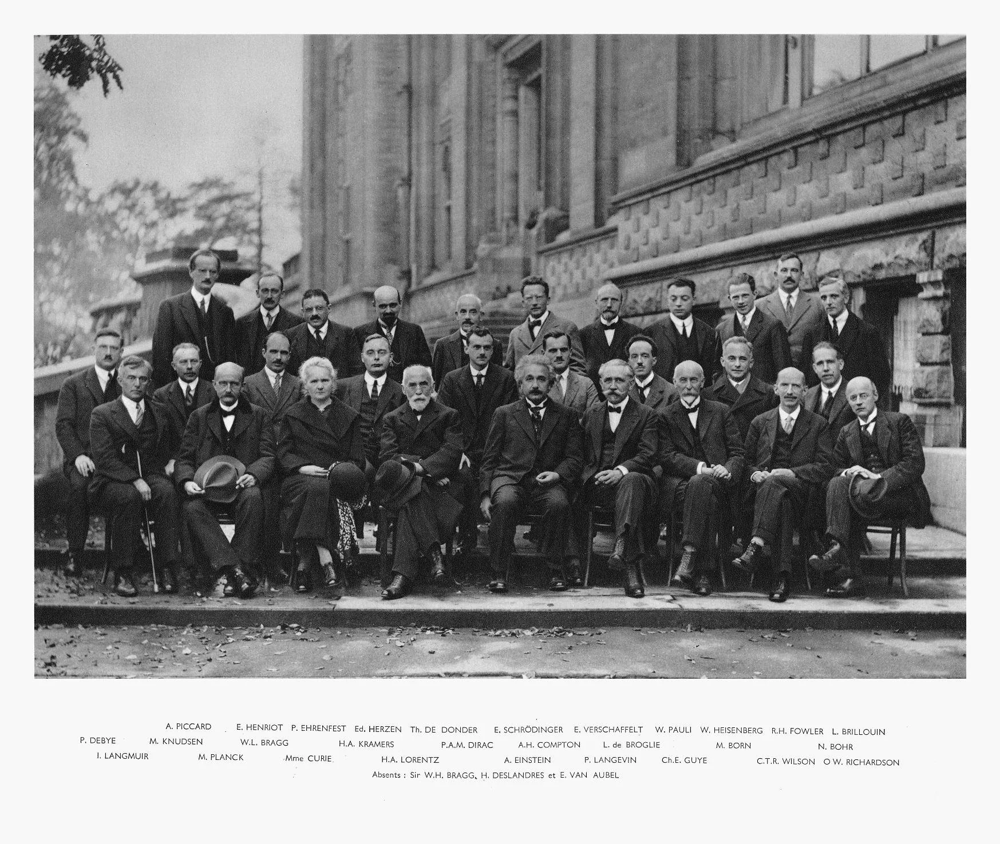
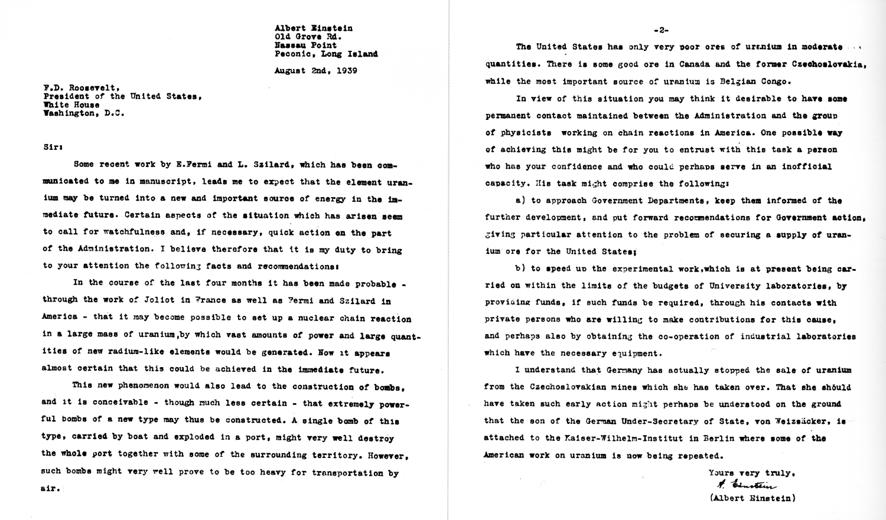
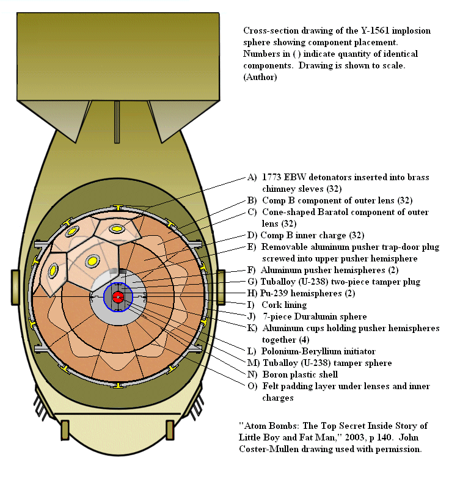
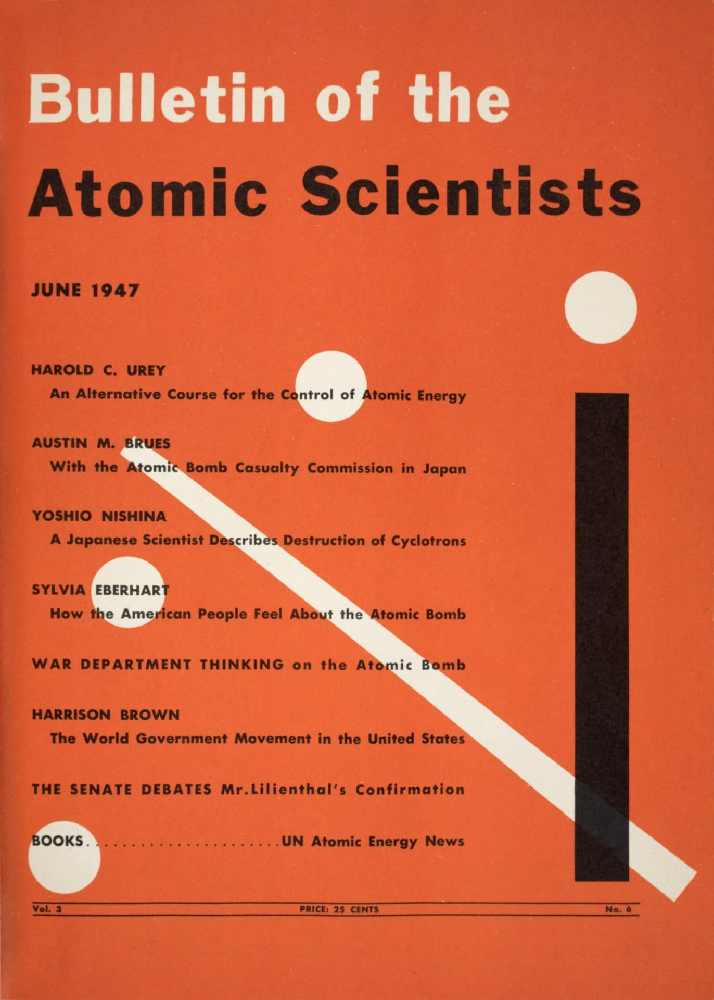
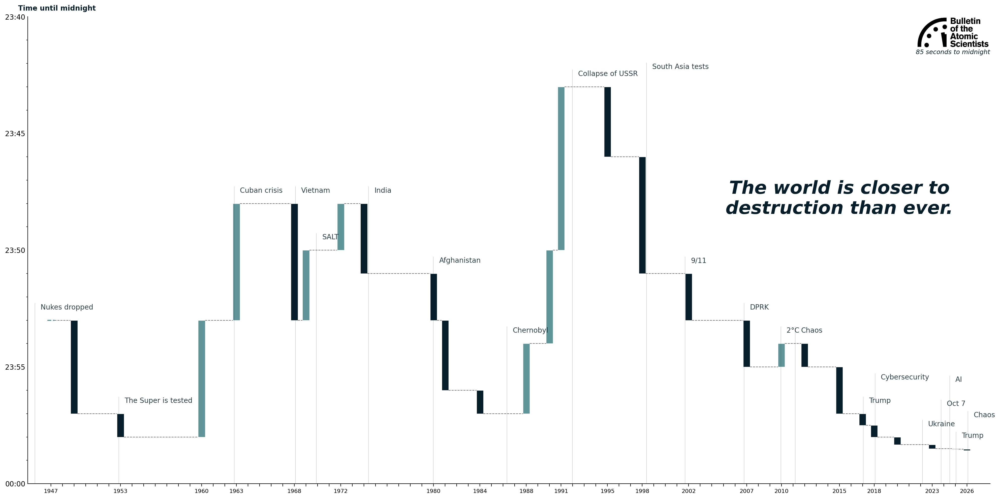

# The Doomsday Clock

> There is not the slightest indication that nuclear energy will ever be obtainable.  
> — A. Einstein, 1934

*Solvay Conference, 1927.* "The most intelligent picture ever taken." Belgium, Brussels.

Until 1939, harnessing nuclear energy was thought impossible. Yet steady developments in the realms of nuclear physics were made throughout the first half of the 20th century. The discovery of the neutron as an integral part of β-decay in 1932 set the foundation for the future discovery of nuclear fission. Seven years later, in January of 1939, a theoretical work based on a recent documented fissile reaction postulated that 2-to-3 additional neutrons would be released in the process of fission, suggesting the possibility of an exponential chain reaction.

*Einstein-Szilard letter to the U.S. president concerning nuclear bombs, Aug 2 1939.*

With Nazi Germany cutting off its uranium exports in April 1939, the U.S. eventually realizes its difficult predicament. The Einstein-Szilard letter in August 1939 jumpstarts the inquiry into the possibility of creating nuclear weapons, with the National Defense Research Center being formed in 1940 for that exact purpose. While both Nazi Germany and the U.S. had no shortage of qualified personnel, the U.S. did not have quality uranium ore. Funneled into the war by Pearl Harbor, the U.S. splurged $2 bln. to develop three\* nuclear bombs—"Gadget," "Fat man," "Little boy," and "*Third shot*"—from 1942-45 within the framework of the top-secret Manhattan project, which employed 130'000 people at its peak. 

*The declassified\* design of Fat Man, an implosion-type fission nuclear bomb. 2003.* "The bomb would cost $40.5 million today in raw material."

After the bombing of Japan, many scientists of the Manhattan project realized they needed a new way to communicate between themselves and the public. On the 26th of September of 1945, a group of Manhattan scientists from the University of Chicago formed the "Atomic Scientists of Chicago." By December, the group—by then presented themselves as *Bulletin of the Atomic Scientists*—published their first newsletter. Over the coming years, the bulletin would have many renowned contributors, with Albert Einstein, Max Born, and the father of the atomic bomb Robert Oppenheimer among many. By 1947, the bulletin became a fully-fledged magazine and revealed its Doomsday clock, which was set to 7:00 minutes to midnight.

*First issue of the Bulletin's magazine, June 1947.* "The debut of the Doomsday clock."

The clock serves as a cumulative gauge of humanity's progression towards self-destruction. It counts down minutes and seconds until "midnight," or the end of human civilization as we know it. Originally designed to inform the public about the threat of nuclear escalation, the clock now considers efforts (or lack thereof) to address climate change, developments in biological threats, introduction of disruptive technologies, and current political leadership. 

The Doomsday clock is a manual, logarithmic, and ambitemporal clock. After consequential events, but not more than once a year, an assembly of experts preside on humanity's progress towards self-annihilation, inching the clock forward if they deem that humanity has not made sufficient progress in addressing existential threats.

*Timeline of the Doomsday clock as a waterfall chart.* 1947-2026. "It is now 85 seconds to midnight."

It is now 85 seconds to midnight. Yet the purpose of the clock is not to scare, but to be a call to action—to provide people with enough information to act to preserve our delicate world order.

## References

American Physical Society. "December 1938: Discovery of Nuclear Fission." APS News 16, no. 11 (December 2007). Accessed April 4, 2026. https://www.aps.org/apsnews/2007/12/december-1938-discovery-nuclear-fission.
Britannica Editors. "Manhattan Project." Encyclopædia Britannica. Accessed April 5, 2026. https://www.britannica.com/event/Manhattan-Project.
Britannica Editors. "Solvay Conferences." Encyclopædia Britannica. Accessed April 4, 2026. https://www.britannica.com/event/Solvay-Conferences.
Bulletin of the Atomic Scientists. "Doomsday Clock." Accessed April 5, 2026. https://thebulletin.org/doomsday-clock.
Bulletin of the Atomic Scientists. "How the Bulletin of the Atomic Scientists Got Its Start." Virtual Tour. Accessed April 4, 2026. https://thebulletin.org/virtual-tour/how-the-bulletin-of-the-atomic-scientists-got-its-start/.
Google Arts & Culture. "3D Periodic Table." Accessed April 2, 2026. https://artsexperiments.withgoogle.com/periodic-table/.
Maltseva, Luna. "Atomic Interactions." Accessed April 5, 2026. https://lunamaltseva.dev/decay.
MIRA Safety. "Project Sundial: The Untold Story of the Biggest Nuclear Bomb." MIRA Safety Blog. Accessed April 6, 2026. https://www.mirasafety.com/blogs/news/project-sundial-the-untold-story-of-the-biggest-nuclear-bomb.
Simpson, Edward C. "Colourful Nuclide Chart." Australian National University, Department of Nuclear Physics and Accelerator Applications. Accessed April 4, 2026. https://people.physics.anu.edu.au/~ecs103/chart/.
US Environmental Protection Agency. "Radioactive Decay." Accessed April 4, 2026. https://www.epa.gov/radiation/radioactive-decay.
Wellerstein, Alex. "NUKEMAP." Nuclear Secrecy. Accessed March 30, 2026. https://nuclearsecrecy.com/nukemap/.
Wikipedia contributors. "Fat Man." Wikipedia: The Free Encyclopedia. Last modified [date varies]. https://en.wikipedia.org/wiki/Fat_Man.
